# 관통프로젝트2

## 프로젝트 정보

### PJT명: Happy House Project - Web Front PJT

### 팀원: 이광우, 황재완

### 구현 현황

| 기본 기능                                       |     |
| ----------------------------------------------- | --- |
| 메인 페이지 및 메뉴 구성                        | ⭕  |
| 회원 페이지 - 회원 가입 화면                    | ⭕  |
| 회원 페이지 - 회원 정보 수정 화면               | ⭕  |
| 회원 페이지 - 회원 탈퇴 화면                    | ⭕  |
| 회원 페이지 - 회원 상세 조회 화면               | ⭕  |
| 로그인/로그아웃 페이지                          | ⭕  |
| 실거래가 조회, 결과 페이지 - 전체 조회 화면     | ⭕  |
| 실거래가 조회, 결과 페이지 - 상세 조회 화면     | ⭕  |
| 실거래가 조회, 결과 페이지 - 동별 화면          | ⭕  |
| 실거래가 조회, 결과 페이지 - 아파트별 조회 화면 | ⭕  |
| 화면 별 Javascript 기능                         | ⭕  |

## 구현 내용 (웹 페이지)

### 1. 메인 화면

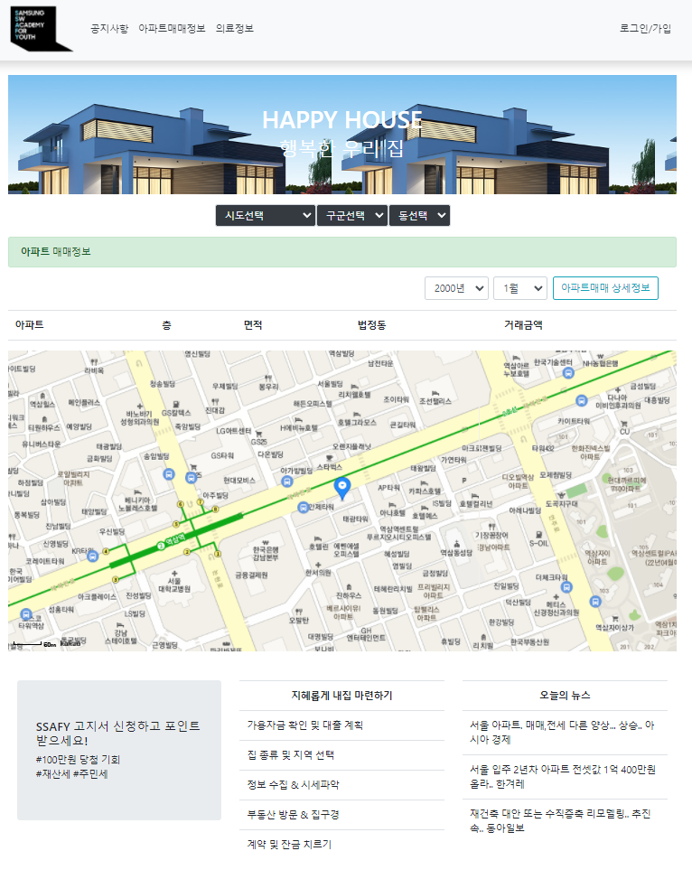

### 2. 로그인 로그아웃 화면

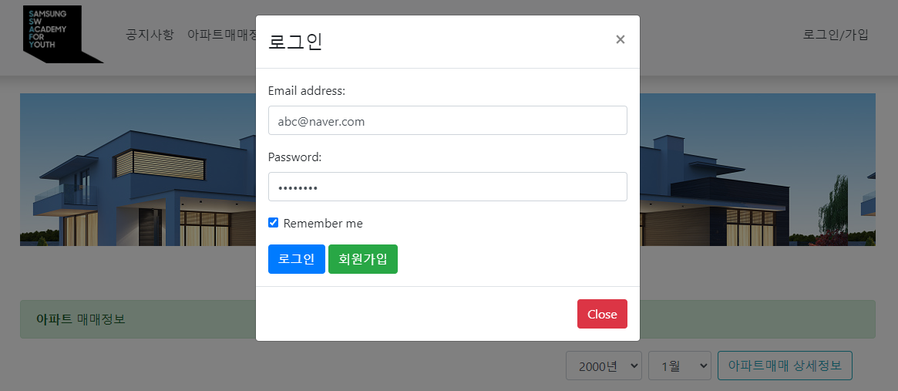

### 3. 회원정보 조회 화면

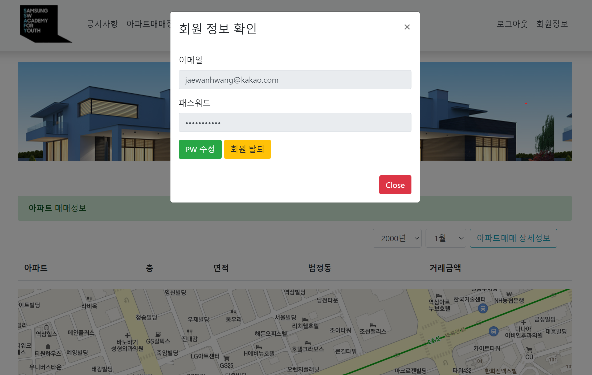

### 4. 회원정보 수정 화면

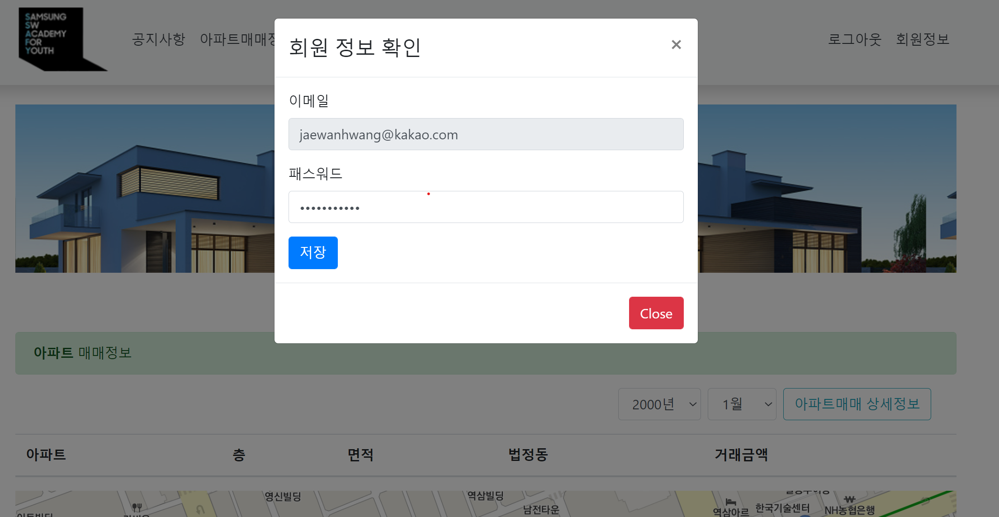

### 5. 회원 탈퇴 화면

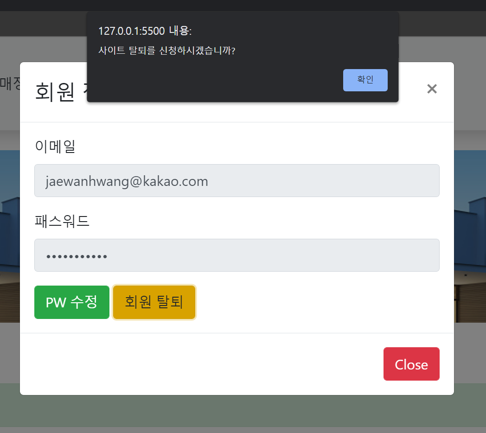

### 6. 회원 가입 화면

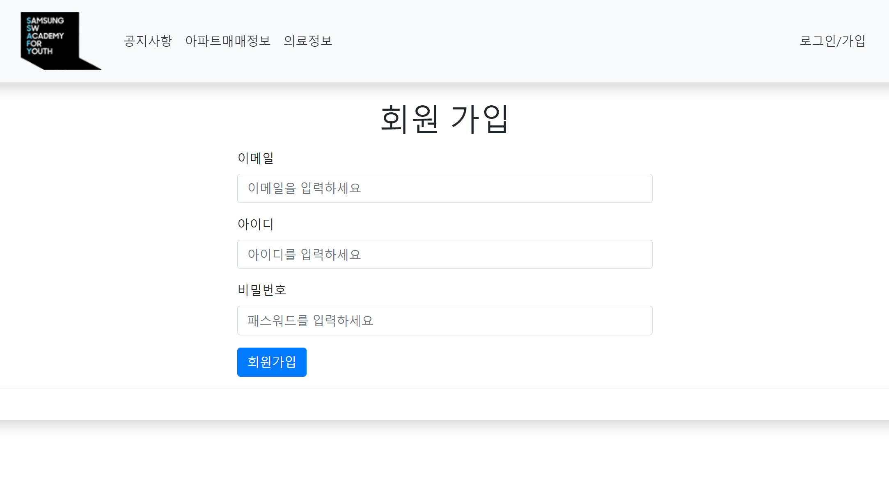

### 7. 동별 실거래가 조회 결과 화면

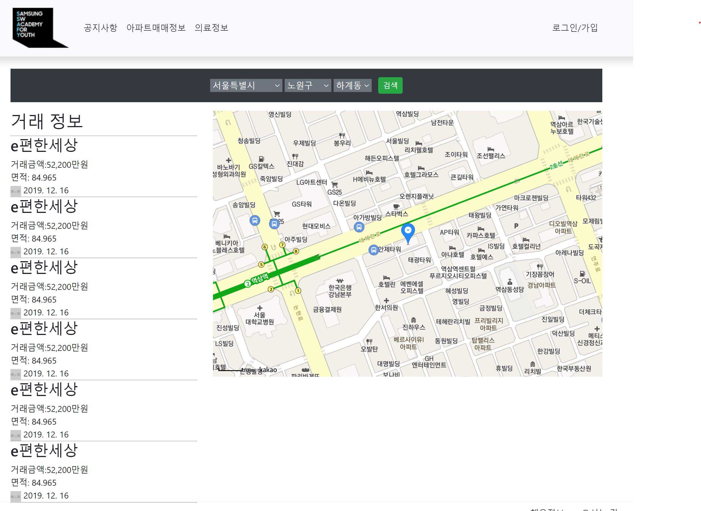

### 8. 아파트별 실거래가 조회 결과 화면

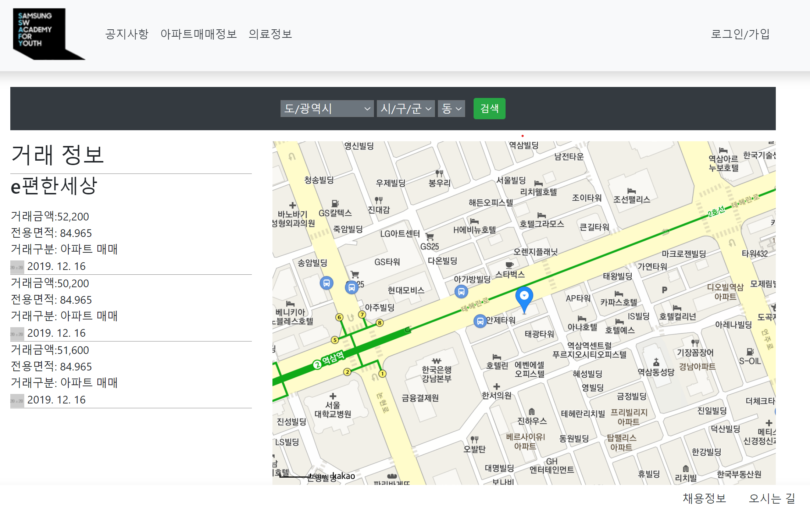

## 구현 기능 (JavaScript)

### 1. 로그인 페이지의 로그인 버튼이 클릭될 경우, 입력된 ID 및 비밀번호를 브라우저 console 에 출력

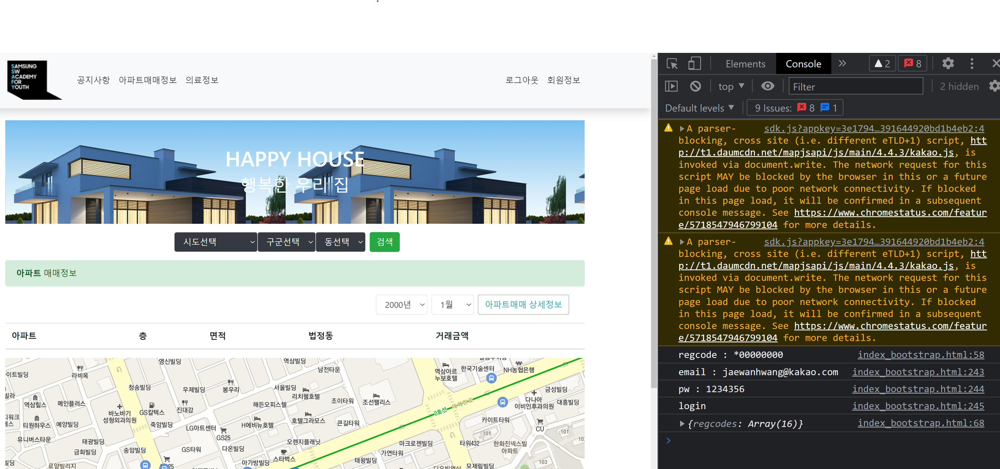

### 2. 회원가입 페이지의 가입 버튼이 클릭될 경우, 입력내용을 브라우저 console 에 출력

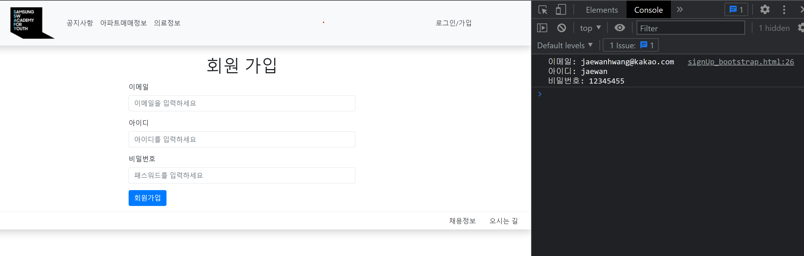

### 3. 메인 페이지의 검색 버튼이 클릭될 경우, 사용자가 선택한 검색어 및 선택 항목 내용을 브라우저 console 에 출력

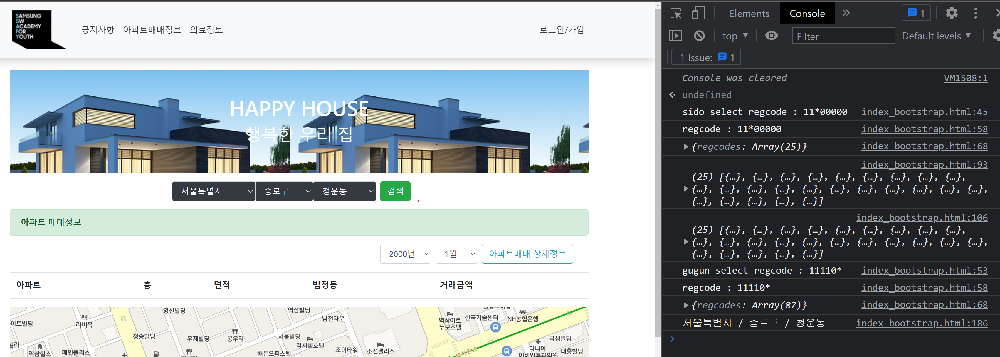

### 4. 로그인 및 로그아웃 페이지에서 해당 버튼(링크) 가 클릭될 경우, 브라우저 console 에 “login” 또는 logout” 출력

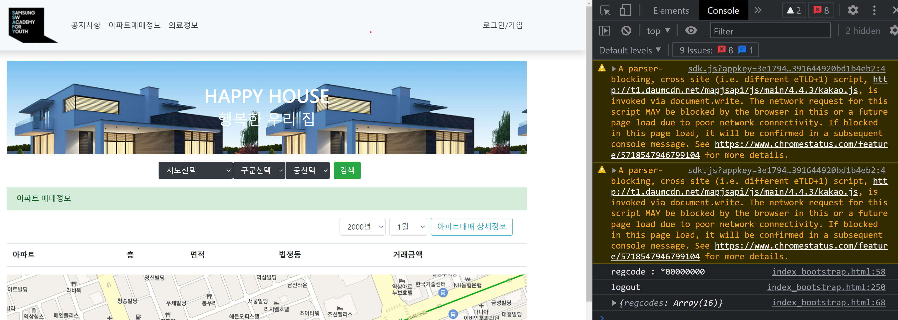

<br><br><br><br><br><br><br><br><br><br><br><br>

# 관통프로젝트3

## 프로젝트 정보

---

PJT명: Happy House Project - DB PJT

팀원: 이광우, 황재완

### 요구사항 목록

| 순번 | 요구사항명          | 요구사항 상세                                                                              | 우선순위 |
| ---- | ------------------- | ------------------------------------------------------------------------------------------ | -------- |
| F01  | 주택 실거래가 검색  | 주택 실거래가 정보를 원하는 검색 정보에 따라 검색 결과데이터 제공                          | 필수     |
| F02  | 관심 지역 정보 관리 | 관심지역을 설정하여 언제든지 그 지역의 정보를 우선적으로 조회하는 기능을 제공              | 필수     |
| F03  | 회원 관리           | 회원정보 가입, 수정, 검색                                                                  | 필수     |
| F04  | 주택 정보 관리      | 주택 실거래가 정보를 통해 주택 정보를 추출해서 주택에 대한 기본 정보를 관리하는 기능을제공 | 필수     |

---

## 구현 내용

### ✔️ HappyHouse ERD

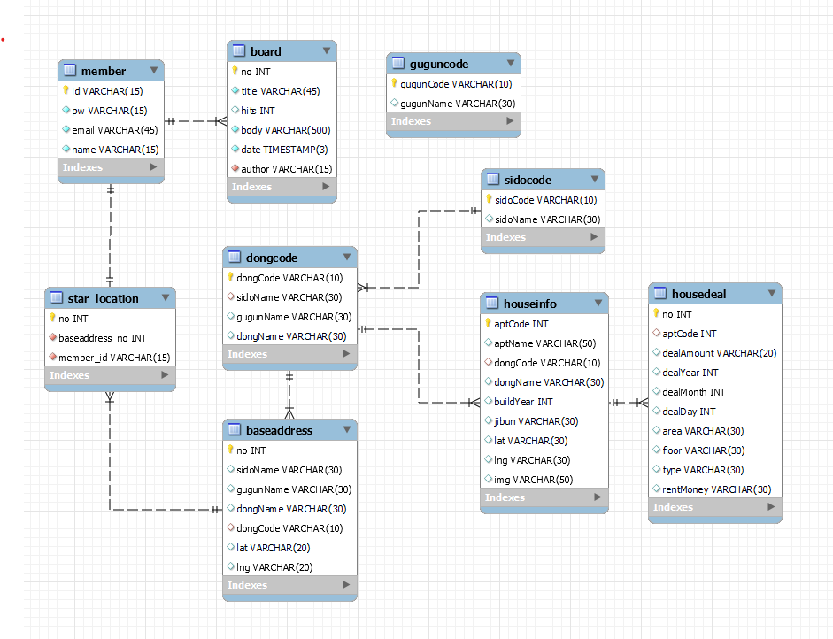

- 회원관리를 위한 member table을 추가하였다.
- 공지사항 관리를 위한 board table을 추가하였다. member table과 1:N의 관계이다.
- 관심지역을 관리하는 star_location table을 추가하였다. member table과 1:1의 관계이다.
- sidocode, guguncode, dongcode는 각각 시도/구군/동에 대한 법정동코드와 이름을 담고 있는 테이블이다.
- baseaddress는 star_location과 1:N관계이고 dongcode와 N:1관계로서 대한민국의 모든 동을 법정동 코드와 시도/구군을 포함한 풀네임, 위도, 경도 정보를 포함한다.
- houseinfo는 아파트 매매정보 에서 뽑아낸 아파트 고유의 정보를 따로 저장, 관리한다.
- housedeal은 국토교통부 아파트 매매 실거래 상세 자료에서 받은 data를 필요한 정보만 뽑아 아파트 매매 테이블로 관리한다.

### ✔️ 1. 동별, 아파트별 매매 실거래가 정보 Table을 설계하고 데이터를 입력하고, 조회할 수 있는 DAO클래스 구현.

- 매매 실거래가 정보를 insert하거나 동별로 한번에 리스트에 담아 가져온다.

```java
package com.ssafy.model.dao;

import java.sql.Connection;
import java.sql.DriverManager;
import java.sql.PreparedStatement;
import java.sql.ResultSet;
import java.sql.SQLException;
import java.util.ArrayList;
import java.util.List;

import com.ssafy.model.dto.HouseDeal;


public class HouseDealDAO {

	private static final String DRIVER = "com.mysql.cj.jdbc.Driver";
	private static final String URL ="jdbc:mysql://127.0.0.1:3306/dbtest?serverTimezone=UTC";
	private static final String USER ="ssafy";
	private static final String PASSWORD = "ssafy";

	static {
		try {
			Class.forName(DRIVER);
		} catch (ClassNotFoundException e) {
			e.printStackTrace();
		}
	}

	public boolean insertHouseDeal(HouseDeal houseDeal) {
		Connection conn = null;
		PreparedStatement stmt = null;
		String sql = "insert into housedeal(aptCode, dealAmount, dealYear, dealMonth, dealDay, area, floor, type, rentMoney) " +
				"values(?, ?, ?, ?, ?, ?, ?, ?, ?);";
		try {
			conn = DriverManager.getConnection(URL, USER, PASSWORD);
			stmt = conn.prepareStatement(sql);

			stmt.setInt(1,  houseDeal.getAptCode());
			stmt.setString(2,  houseDeal.getDealAmount());
			stmt.setInt(3,  houseDeal.getDealYear());
			stmt.setInt(4,  houseDeal.getDealMonth());
			stmt.setInt(5,  houseDeal.getDealDay());
			stmt.setString(6,  houseDeal.getArea());
			stmt.setString(7,  houseDeal.getFloor());
			stmt.setString(8,  houseDeal.getType());
			stmt.setString(9,  houseDeal.getRentMoney());

			int rowCount = stmt.executeUpdate();
			return rowCount > 0;
		} catch (SQLException e) {
			e.printStackTrace();
		} finally {
			if(stmt != null)
				try {
					stmt.close();
				} catch (SQLException e) {
					e.printStackTrace();
				}
			if(conn != null)
				try {
					conn.close();
				} catch (SQLException e) {
					e.printStackTrace();
				}
		}
		return false;
	}

	public List<HouseDeal> selectHouseDealsByDongCode(String dongCode) {
		Connection conn = null;
		PreparedStatement stmt = null;
		ResultSet rs = null;
		String sql = "select no, aptCode, dealAmount, dealYear, dealMonth, dealDay, area, floor, type, rentMoney " +
				"from housedeal join houseinfo " +
				"on housedeal.aptCode = houseinfo.aptCode " +
				"where houseinfo.dongCode = ?;";
		List<HouseDeal> houseDeals = new ArrayList<HouseDeal>();
		try {
			conn = DriverManager.getConnection(URL, USER, PASSWORD);
			stmt = conn.prepareStatement(sql);
			stmt.setString(1, dongCode);

			rs = stmt.executeQuery();
			while(rs.next()) {
				houseDeals.add(new HouseDeal(rs.getInt(1), rs.getInt(2), rs.getString(3), rs.getInt(4), rs.getInt(5), rs.getInt(6), rs.getString(7), rs.getString(8), rs.getString(9), rs.getString(10)));
			}
		} catch (SQLException e) {
			e.printStackTrace();
		} finally {
			if(rs!=null) {
				try {
					rs.close();
				} catch (SQLException e) {
					e.printStackTrace();
				}
			}
			if(stmt != null)
				try {
					stmt.close();
				} catch (SQLException e) {
					e.printStackTrace();
				}
			if(conn != null)
				try {
					conn.close();
				} catch (SQLException e) {
					e.printStackTrace();
				}
		}
		return houseDeals;
	}

}
```

### ✔️ 2. 회원정보를 관리할 수 있는 Table 설계 및 DAO클래스 구현

- 회원정보의 추가, 삭제, 조회하는 기능을 구현하였다.

```java
package com.ssafy.model.dao;

import java.sql.Connection;
import java.sql.DriverManager;
import java.sql.PreparedStatement;
import java.sql.ResultSet;
import java.sql.SQLException;

import com.ssafy.model.dto.*;

public class MemberDAO {

	private static final String DRIVER ="com.mysql.cj.jdbc.Driver";
	private static final String URL = "jdbc:mysql://127.0.0.1:3306/happyhouse?serverTimezone=UTC";
	private static final String USER ="ssafy";
	private static final String PASSWORD ="ssafy";

	static {
		// 1. JDBC Driver 등록
        // 한번만 수행해도 되니 static쪽으로 빼둠
        // 에러가 발생할 수 있으니 예외처리 해야함
		try {
			Class.forName(DRIVER);
		} catch (ClassNotFoundException e) {
			e.printStackTrace();
			System.out.println("ERROR");
		}
	}

	// Insert
	public boolean insertMember(Member member) {
		// DB와 연결하기 위한 Connection 객체 생성
		Connection conn = null;

		// DB와 통신하기 위한 전용통로 PreparedStatement 객체 생성
		PreparedStatement stmt = null;

		// ?라는 와일드 카드를 적용(반복되는 구문을 손쉽게 처리 가능)
		String sql = "insert into member values(?,?,?,?)";
		try {
			// DB와 연결
			conn = DriverManager.getConnection(URL, USER, PASSWORD);
			// 연결 통로 생성(PreparedStatement이므로 sql 삽입해야함)
			stmt = conn.prepareStatement(sql);

			// 연결해뒀으니 (순서, 값) 으로 값 대입
			stmt.setString(1, member.getId());
			stmt.setString(2, member.getPw());
			stmt.setString(3, member.getEmail());
			stmt.setString(3, member.getName());

			// SQL을 넣을 필요 없음(stmt에서 이미 넣었음)
			int rowCount = stmt.executeUpdate();
			// 제대로 되면 true 반환
			return rowCount > 0;
		} catch (SQLException e) {
			e.printStackTrace();
		} finally {
			if (stmt != null) {
				try {
					stmt.close();
				} catch (SQLException e) {
					e.printStackTrace();
				}
			}
			if (conn != null) {
				try {
					conn.close();
				} catch (SQLException e) {
					e.printStackTrace();
				}
			}
		}
		return false;
	}

	// Select
	public Member selectMember(int memberNo) {
		// 연결을 위한 객체들
		Connection conn = null;
		PreparedStatement stmt = null;

		// 수행 결과를 저장할 ResultSet객체
		ResultSet rs = null;

		// ?를 이용한 select SQL
		String sql = "select id, pw, email, name from member where id = ?";
		try {
			// 연결
			conn = DriverManager.getConnection(URL, USER, PASSWORD);
			stmt = conn.prepareStatement(sql);
			// ? 에 값 대입
			stmt.setInt(1, memberNo);

			// 결과를 ResultSet객체에 저장
			rs = stmt.executeQuery();

			// Select의 결과를 다음부터 읽어와야함(결과가 없을 수 도 있기 때문에 이렇게 설정됨)
			if (rs.next()) {
				// 속성의 순서로도, 이름으로도 값을 가져올 수 있음
				return new Member(rs.getString(1), rs.getString(2), rs.getString(3), rs.getString(4));
			}
		} catch (SQLException e) {
			e.printStackTrace();
		} finally {
			// 해제
			if (rs != null) {
				try {
					rs.close();
				} catch (SQLException e) {
					e.printStackTrace();
				}
			}
			if (stmt != null) {
				try {
					stmt.close();
				} catch (SQLException e) {
					e.printStackTrace();
				}
			}
			if (conn != null) {
				try {
					conn.close();
				} catch (SQLException e) {
					e.printStackTrace();
				}
			}
		}
		return null;
	}

	// Delete
	public void deleteMember(String id) {
		Connection conn = null;
		PreparedStatement stmt = null;

		String sql = "delete from member \n";
		sql += "where id = ?";

		try {
			// DB와 연결
			conn = DriverManager.getConnection(URL, USER, PASSWORD);
			// 연결 통로 생성(PreparedStatement이므로 sql 삽입해야함)
			stmt = conn.prepareStatement(sql);

			//값 세팅
			stmt.setString(1, id);

			//preparestatement 실행
			int rowCnt = stmt.executeUpdate();
			System.out.println(rowCnt + "개 삭제성공!");

		} catch (SQLException e) {
			e.printStackTrace();
		}finally {
			if (stmt != null) {
				try {
					stmt.close();
				} catch (SQLException e) {
					e.printStackTrace();
				}
			}
			if (conn != null) {
				try {
					conn.close();
				} catch (SQLException e) {
					e.printStackTrace();
				}
			}
		}
	}
}
```

### ✔️ 3. 관심지역을 관리할 수 있는 Table 설계 및 DAO클래스 구현

- 관심지역을 추가하거나 여러개의 관심지역 정보를 리스트에 담아 가져오거나, 삭제하는 기능을 구현하였다.

```java
package com.ssafy.model.dao;

import java.sql.Connection;
import java.sql.DriverManager;
import java.sql.PreparedStatement;
import java.sql.ResultSet;
import java.sql.SQLException;
import java.util.ArrayList;
import java.util.List;

import com.ssafy.model.dto.StarredLocation;

public class StarredLocationDAO {

	private static final String DRIVER = "com.mysql.cj.jdbc.Driver";
	private static final String URL ="jdbc:mysql://127.0.0.1:3306/dbtest?serverTimezone=UTC";
	private static final String USER ="ssafy";
	private static final String PASSWORD = "ssafy";

	static {
		try {
			Class.forName(DRIVER);
		} catch (ClassNotFoundException e) {
			e.printStackTrace();
		}
	}

	public boolean insertStarredLocation(int baseAddressNo, String memberId) {
		Connection conn = null;
		PreparedStatement stmt = null;
		String sql = "insert into star_location(baseaddress_no, member_id) values(?, ?)";
		try {
			conn = DriverManager.getConnection(URL, USER, PASSWORD);
			stmt = conn.prepareStatement(sql);

			stmt.setInt(1,  baseAddressNo);
			stmt.setString(2,  memberId);


			int rowCount = stmt.executeUpdate();
			return rowCount > 0;
		} catch (SQLException e) {
			e.printStackTrace();
		} finally {
			if(stmt != null)
				try {
					stmt.close();
				} catch (SQLException e) {
					e.printStackTrace();
				}
			if(conn != null)
				try {
					conn.close();
				} catch (SQLException e) {
					e.printStackTrace();
				}
		}
		return false;
	}

	public List<StarredLocation> selectStarredLocations(String memberId) {
		Connection conn = null;
		PreparedStatement stmt = null;
		ResultSet rs = null;
		String sql = "select star_location.no, sidoName, gugunName, dongName, dongCode from star_location join baseaddress "
				+ "on star_location.baseaddress_no = baseaddress.no where star_location.member_id = ?";
		List<StarredLocation> starredLocations = new ArrayList<StarredLocation>();
		try {
			conn = DriverManager.getConnection(URL, USER, PASSWORD);
			stmt = conn.prepareStatement(sql);
			stmt.setString(1, memberId);

			rs = stmt.executeQuery();
			while(rs.next()) {
				starredLocations.add(new StarredLocation(rs.getInt(1), rs.getString(2), rs.getString(3), rs.getString(4), rs.getString(5)));
			}
		} catch (SQLException e) {
			e.printStackTrace();
		} finally {
			if(rs!=null) {
				try {
					rs.close();
				} catch (SQLException e) {
					e.printStackTrace();
				}
			}
			if(stmt != null)
				try {
					stmt.close();
				} catch (SQLException e) {
					e.printStackTrace();
				}
			if(conn != null)
				try {
					conn.close();
				} catch (SQLException e) {
					e.printStackTrace();
				}
		}
		return starredLocations;
	}

	public boolean deleteStarredLocations(int no) {
		Connection conn = null;
		PreparedStatement stmt = null;
		ResultSet rs = null;
		String sql = "delete from star_location where no = ?;";
		try {
			conn = DriverManager.getConnection(URL, USER, PASSWORD);
			stmt = conn.prepareStatement(sql);
			stmt.setInt(1, no);

			int rowCount = stmt.executeUpdate();
			return rowCount > 0;
		} catch (SQLException e) {
			e.printStackTrace();
		} finally {
			if(rs!=null) {
				try {
					rs.close();
				} catch (SQLException e) {
					e.printStackTrace();
				}
			}
			if(stmt != null)
				try {
					stmt.close();
				} catch (SQLException e) {
					e.printStackTrace();
				}
			if(conn != null)
				try {
					conn.close();
				} catch (SQLException e) {
					e.printStackTrace();
				}
		}
		return false;
	}

}
```
